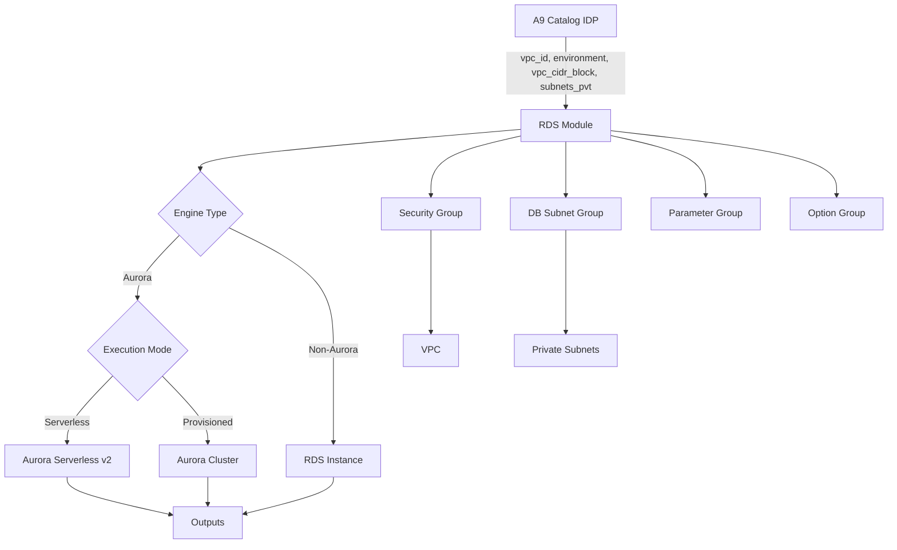

# Design Document

## Overview

O módulo Terraform AWS RDS é projetado para ser um módulo reutilizável e altamente configurável que abstrai a complexidade de provisionar diferentes tipos de bancos de dados RDS na AWS. O módulo suporta tanto instâncias RDS tradicionais quanto clusters Aurora, com modos serverless e provisionado, integrando-se perfeitamente com o A9 Catalog IDP.

### Design Principles

- **Flexibilidade**: Suporte a todos os engines RDS disponíveis com configuração unificada
- **Simplicidade**: Interface clara com defaults inteligentes baseados no ambiente
- **Segurança**: Encryption at rest, security groups restritos, integração com Secrets Manager
- **Modularidade**: Componentes isolados para RDS tradicional, Aurora provisionado e Aurora Serverless
- **IDP-Ready**: Integração nativa com variáveis fornecidas pelo A9 Catalog

## Architecture

### High-Level Architecture




### Module Structure

```
aws-rds-module/
├── main.tf                 # Main resource definitions and conditional logic
├── variables.tf            # Input variable declarations
├── outputs.tf              # Output definitions
├── locals.tf               # Local values and computed variables
├── security.tf             # Security group and IAM resources
├── versions.tf             # Terraform and provider version constraints
├── README.md               # Module documentation
└── examples/
    ├── aurora-serverless/
    ├── aurora-provisioned/
    ├── rds-mysql/
    └── rds-postgres/
```

## Components and Interfaces

### 1. Input Variables (variables.tf)

#### IDP-Provided Variables (Required)
- `vpc_id` (string): VPC ID fornecido pelo A9 Catalog
- `environment` (string): Environment name (dev, staging, prod)
- `vpc_cidr_block` (string): VPC CIDR block para security group rules
- `subnets_pvt` (list(string)): Lista de subnet IDs privadas

#### Database Configuration (Required)
- `engine` (string): Database engine (mysql, postgres, aurora-mysql, aurora-postgresql, mariadb, oracle-*, sqlserver-*)
- `engine_version` (string): Engine version
- `master_username` (string): Master username
- `master_password` (string): Master password (sensitive)

#### Execution Mode
- `is_aurora` (bool): Se true, provisiona Aurora cluster
- `is_serverless` (bool): Se true e is_aurora=true, usa Aurora Serverless v2
- `instance_class` (string): Instance class para modo provisionado
- `allocated_storage` (number): Storage em GB para RDS não-Aurora

#### Serverless Configuration (Optional)
- `serverless_min_capacity` (number): Mínimo ACU (default: 0.5)
- `serverless_max_capacity` (number): Máximo ACU (default: 1.0)

#### High Availability (Optional)
- `multi_az` (bool): Enable Multi-AZ para RDS não-Aurora (default: false)
- `replica_count` (number): Número de read replicas para Aurora (default: 0)

#### Backup and Maintenance (Optional)
- `backup_retention_period` (number): Dias de retenção (default: 7)
- `backup_window` (string): Backup window UTC (default: "03:00-04:00")
- `maintenance_window` (string): Maintenance window UTC (default: "sun:04:00-sun:05:00")
- `auto_minor_version_upgrade` (bool): Auto upgrade (default: true)
- `deletion_protection` (bool): Deletion protection (default: true)

#### Security (Optional)
- `additional_cidr_blocks` (list(string)): CIDRs adicionais com acesso (default: [])
- `enable_encryption` (bool): Enable encryption at rest (default: true)
- `kms_key_id` (string): KMS key ARN (default: null, usa default AWS key)
- `store_credentials_in_secrets_manager` (bool): Store em Secrets Manager (default: false)

#### Customization (Optional)
- `database_name` (string): Nome do database inicial (default: null)
- `parameter_group_parameters` (map(string)): Custom parameters (default: {})
- `option_group_options` (list(object)): Custom options (default: [])
- `custom_tags` (map(string)): Tags customizadas (default: {})
- `enable_performance_insights` (bool): Enable Performance Insights (default: false)
- `performance_insights_retention_period` (number): Retention em dias (default: 7)

### 2. Local Values (locals.tf)

```hcl
locals {
  # Identificação
  name_prefix = "${var.environment}-rds"
  
  # Engine detection
  is_aurora = var.is_aurora || contains(["aurora-mysql", "aurora-postgresql"], var.engine)
  is_serverless = var.is_serverless && local.is_aurora
  
  # Port mapping
  port_map = {
    mysql              = 3306
    postgres           = 5432
    aurora-mysql       = 3306
    aurora-postgresql  = 5432
    mariadb            = 3306
    oracle-ee          = 1521
    oracle-se2         = 1521
    oracle-se1         = 1521
    oracle-se          = 1521
    sqlserver-ee       = 1433
    sqlserver-se       = 1433
    sqlserver-ex       = 1433
    sqlserver-web      = 1433
  }
  db_port = lookup(local.port_map, var.engine, 3306)
  
  # Environment-based defaults
  default_instance_class = {
    dev     = "db.t3.small"
    staging = "db.t3.medium"
    prod    = "db.r5.large"
  }
  instance_class = var.instance_class != null ? var.instance_class : lookup(local.default_instance_class, var.environment, "db.t3.small")
  
  # Tags
  default_tags = {
    Environment = var.environment
    ManagedBy   = "terraform"
    Module      = "aws-rds-module"
  }
  tags = merge(local.default_tags, var.custom_tags)
}
```

### 3. Security Resources (security.tf)

#### Security Group
- Ingress rule: Allow traffic on db_port from vpc_cidr_block
- Ingress rules: Allow traffic from additional_cidr_blocks (if provided)
- Egress rule: Allow all outbound traffic
- Tags: Merged default and custom tags

#### Secrets Manager (Conditional)
- Secret resource para armazenar credenciais quando `store_credentials_in_secrets_manager = true`
- Secret version com JSON contendo username, password, endpoint, port

### 4. Database Resources (main.tf)

#### DB Subnet Group
- Resource: `aws_db_subnet_group`
- Subnet IDs: `var.subnets_pvt`
- Name: `${local.name_prefix}-subnet-group`

#### Parameter Group (Conditional)
- Resource: `aws_db_parameter_group` ou `aws_rds_cluster_parameter_group`
- Family: Determinado pelo engine e version
- Parameters: `var.parameter_group_parameters`

#### Option Group (Conditional)
- Resource: `aws_db_option_group`
- Apenas para engines que suportam (MySQL, MariaDB, Oracle, SQL Server)
- Options: `var.option_group_options`

#### RDS Instance (Non-Aurora)
- Resource: `aws_db_instance`
- Condition: `!local.is_aurora`
- Engine: `var.engine`
- Instance class: `local.instance_class`
- Allocated storage: `var.allocated_storage`
- Multi-AZ: `var.multi_az`
- Encryption: `var.enable_encryption`
- KMS key: `var.kms_key_id`

#### Aurora Cluster (Aurora Provisioned)
- Resource: `aws_rds_cluster`
- Condition: `local.is_aurora && !local.is_serverless`
- Engine: `var.engine`
- Engine mode: `provisioned`
- Master credentials: `var.master_username`, `var.master_password`

#### Aurora Cluster Instances (Aurora Provisioned)
- Resource: `aws_rds_cluster_instance`
- Count: `1 + var.replica_count`
- Instance class: `local.instance_class`
- Distributed across AZs

#### Aurora Serverless v2 Cluster
- Resource: `aws_rds_cluster`
- Condition: `local.is_aurora && local.is_serverless`
- Engine mode: `provisioned` (Serverless v2 usa provisioned mode)
- Serverless v2 scaling configuration block
- Min capacity: `var.serverless_min_capacity`
- Max capacity: `var.serverless_max_capacity`

#### Aurora Serverless v2 Instance
- Resource: `aws_rds_cluster_instance`
- Count: 1
- Instance class: `db.serverless` (para Serverless v2)


### 5. Outputs (outputs.tf)

#### Common Outputs
- `endpoint`: Database endpoint address
- `port`: Database port number
- `database_name`: Database name
- `security_group_id`: Security group ID
- `db_subnet_group_name`: DB subnet group name
- `master_username`: Master username (non-sensitive)

#### RDS-Specific Outputs
- `instance_id`: RDS instance ID (quando não-Aurora)
- `instance_arn`: RDS instance ARN (quando não-Aurora)
- `instance_resource_id`: Resource ID (quando não-Aurora)

#### Aurora-Specific Outputs
- `cluster_id`: Aurora cluster ID (quando Aurora)
- `cluster_arn`: Aurora cluster ARN (quando Aurora)
- `cluster_endpoint`: Cluster writer endpoint (quando Aurora)
- `cluster_reader_endpoint`: Cluster reader endpoint (quando Aurora)
- `cluster_members`: Lista de instance IDs no cluster (quando Aurora)

#### Secrets Manager Output
- `secret_arn`: ARN do secret (quando `store_credentials_in_secrets_manager = true`)

## Data Models

### Engine Configuration Map

```hcl
variable "engine_config" {
  type = map(object({
    family                = string
    supports_option_group = bool
    default_port          = number
  }))
  default = {
    mysql = {
      family                = "mysql8.0"
      supports_option_group = true
      default_port          = 3306
    }
    postgres = {
      family                = "postgres14"
      supports_option_group = false
      default_port          = 5432
    }
    # ... outros engines
  }
}
```

### Validation Rules

```hcl
# Validação: Serverless apenas com Aurora
validation {
  condition     = !var.is_serverless || local.is_aurora
  error_message = "Serverless mode is only supported with Aurora engines."
}

# Validação: Engine válido
validation {
  condition = contains([
    "mysql", "postgres", "mariadb",
    "aurora-mysql", "aurora-postgresql",
    "oracle-ee", "oracle-se2", "oracle-se1", "oracle-se",
    "sqlserver-ee", "sqlserver-se", "sqlserver-ex", "sqlserver-web"
  ], var.engine)
  error_message = "Invalid engine specified."
}

# Validação: Backup retention period
validation {
  condition     = var.backup_retention_period >= 0 && var.backup_retention_period <= 35
  error_message = "Backup retention period must be between 0 and 35 days."
}

# Validação: Replica count para Aurora
validation {
  condition     = var.replica_count >= 0 && var.replica_count <= 15
  error_message = "Aurora replica count must be between 0 and 15."
}
```

## Error Handling

### Validation Strategy

1. **Input Validation**: Usar `validation` blocks nas variáveis para validar valores antes da execução
2. **Conditional Resources**: Usar `count` e `for_each` com condições para criar recursos apenas quando aplicável
3. **Preconditions**: Usar lifecycle `precondition` blocks para validações complexas
4. **Error Messages**: Mensagens claras e acionáveis para cada tipo de erro

### Common Error Scenarios

#### Scenario 1: Serverless com engine não-Aurora
- **Detection**: Validation block em `var.is_serverless`
- **Message**: "Serverless mode is only supported with Aurora MySQL and Aurora PostgreSQL engines"
- **Resolution**: Usuário deve definir `is_aurora = true` ou escolher engine Aurora

#### Scenario 2: Instance class incompatível
- **Detection**: Precondition no resource `aws_db_instance` ou `aws_rds_cluster_instance`
- **Message**: "Instance class {class} is not compatible with engine {engine}"
- **Resolution**: Consultar documentação AWS para instance classes válidas

#### Scenario 3: Subnets em AZs insuficientes
- **Detection**: Precondition no `aws_db_subnet_group`
- **Message**: "DB subnet group requires subnets in at least 2 availability zones"
- **Resolution**: Fornecer subnets em múltiplas AZs via `subnets_pvt`

#### Scenario 4: Multi-AZ com Aurora
- **Detection**: Validation block
- **Message**: "Multi-AZ is not applicable for Aurora. Use replica_count instead"
- **Resolution**: Usar `replica_count` para alta disponibilidade em Aurora

### Terraform State Management

- **Sensitive Values**: Marcar `master_password` e outputs de credenciais como `sensitive = true`
- **Lifecycle Rules**: 
  - `prevent_destroy = true` para recursos de produção (baseado em `var.environment`)
  - `ignore_changes` para `master_password` após criação inicial
- **Timeouts**: Configurar timeouts apropriados para operações de longa duração (create, update, delete)

## Testing Strategy

### Unit Testing (Terratest)

#### Test 1: RDS MySQL Provisioned
- **Objetivo**: Validar criação de instância RDS MySQL não-Aurora
- **Inputs**: engine=mysql, is_aurora=false, instance_class=db.t3.small
- **Assertions**:
  - RDS instance criada
  - Security group permite tráfego na porta 3306
  - Subnet group criado com subnets corretas
  - Outputs contêm endpoint e port

#### Test 2: Aurora PostgreSQL Serverless
- **Objetivo**: Validar criação de Aurora Serverless v2
- **Inputs**: engine=aurora-postgresql, is_aurora=true, is_serverless=true
- **Assertions**:
  - Aurora cluster criado com engine mode correto
  - Serverless scaling configuration presente
  - Cluster instance com class db.serverless
  - Outputs contêm cluster_endpoint e reader_endpoint

#### Test 3: Aurora MySQL Provisioned com Replicas
- **Objetivo**: Validar criação de Aurora com read replicas
- **Inputs**: engine=aurora-mysql, is_aurora=true, replica_count=2
- **Assertions**:
  - Aurora cluster criado
  - 3 instances criadas (1 writer + 2 readers)
  - Instances distribuídas em AZs diferentes
  - Reader endpoint disponível

#### Test 4: Security Group Configuration
- **Objetivo**: Validar regras de security group
- **Inputs**: vpc_cidr_block=10.0.0.0/16, additional_cidr_blocks=["192.168.1.0/24"]
- **Assertions**:
  - Security group permite ingress do VPC CIDR
  - Security group permite ingress dos CIDRs adicionais
  - Porta correta baseada no engine

#### Test 5: Encryption and Secrets Manager
- **Objetivo**: Validar encryption e integração com Secrets Manager
- **Inputs**: enable_encryption=true, store_credentials_in_secrets_manager=true
- **Assertions**:
  - RDS/Aurora criado com encryption habilitado
  - Secret criado no Secrets Manager
  - Secret contém credenciais e endpoint

#### Test 6: Environment-Based Defaults
- **Objetivo**: Validar defaults baseados em environment
- **Inputs**: environment=prod (sem instance_class especificado)
- **Assertions**:
  - Instance class padrão para prod aplicado (db.r5.large)
  - Backup retention apropriado
  - Deletion protection habilitado

### Integration Testing

#### Test 1: A9 Catalog Integration
- **Objetivo**: Validar integração com variáveis do IDP
- **Setup**: Simular outputs do A9 Catalog (vpc_id, subnets_pvt, etc.)
- **Assertions**:
  - Módulo aceita todas as variáveis do IDP
  - Recursos criados na VPC correta
  - Subnet group usa subnets fornecidas

#### Test 2: Multi-Engine Support
- **Objetivo**: Validar todos os engines suportados
- **Iterations**: Executar para cada engine (mysql, postgres, mariadb, oracle, sqlserver)
- **Assertions**:
  - Cada engine provisiona corretamente
  - Porta correta para cada engine
  - Parameter group family correto

### Validation Testing

#### Test 1: Invalid Serverless Configuration
- **Objetivo**: Validar erro quando serverless usado com non-Aurora
- **Inputs**: engine=mysql, is_serverless=true, is_aurora=false
- **Expected**: Terraform validation error com mensagem clara

#### Test 2: Invalid Replica Count
- **Objetivo**: Validar erro com replica count fora do range
- **Inputs**: replica_count=20
- **Expected**: Terraform validation error

#### Test 3: Invalid Backup Retention
- **Objetivo**: Validar erro com backup retention inválido
- **Inputs**: backup_retention_period=40
- **Expected**: Terraform validation error

### Manual Testing Checklist

- [ ] Testar criação de cada tipo de engine
- [ ] Testar modo serverless vs provisionado
- [ ] Testar Multi-AZ para RDS tradicional
- [ ] Testar replicas para Aurora
- [ ] Verificar conectividade do endpoint
- [ ] Validar security group rules
- [ ] Testar encryption at rest
- [ ] Verificar integração com Secrets Manager
- [ ] Testar custom parameter groups
- [ ] Validar tags aplicadas
- [ ] Testar backup e restore
- [ ] Verificar Performance Insights (quando habilitado)

## Implementation Notes

### Conditional Logic Pattern

O módulo usa um padrão de conditional logic baseado em `count` e `for_each`:

```hcl
# RDS Instance (non-Aurora)
resource "aws_db_instance" "this" {
  count = local.is_aurora ? 0 : 1
  # ... configuração
}

# Aurora Cluster
resource "aws_rds_cluster" "this" {
  count = local.is_aurora ? 1 : 0
  # ... configuração
}

# Aurora Serverless scaling
dynamic "serverlessv2_scaling_configuration" {
  for_each = local.is_serverless ? [1] : []
  content {
    min_capacity = var.serverless_min_capacity
    max_capacity = var.serverless_max_capacity
  }
}
```

### Naming Convention

Todos os recursos seguem o padrão: `{environment}-rds-{resource-type}-{identifier}`

Exemplos:
- Security Group: `prod-rds-sg`
- DB Subnet Group: `prod-rds-subnet-group`
- RDS Instance: `prod-rds-mysql`
- Aurora Cluster: `prod-rds-aurora-cluster`

### Best Practices Implemented

1. **Least Privilege**: Security groups com acesso mínimo necessário
2. **Encryption by Default**: Encryption at rest habilitado por padrão
3. **Backup Strategy**: Retention de 7 dias por padrão, ajustável por environment
4. **High Availability**: Suporte a Multi-AZ e replicas
5. **Monitoring**: Suporte a Performance Insights
6. **Secrets Management**: Integração opcional com Secrets Manager
7. **Tagging**: Tags consistentes para governança
8. **Deletion Protection**: Habilitado por padrão em produção

### Performance Considerations

- **Aurora Serverless**: Ideal para workloads intermitentes ou imprevisíveis
- **Aurora Provisioned**: Melhor para workloads consistentes com alta performance
- **RDS Multi-AZ**: Adiciona latência mínima mas garante alta disponibilidade
- **Read Replicas**: Distribuem carga de leitura, melhoram performance de queries

### Cost Optimization

- **Environment-based sizing**: Instâncias menores em dev/staging
- **Serverless**: Pay-per-use para ambientes não-produtivos
- **Backup retention**: Menor em dev, maior em prod
- **Deletion protection**: Previne exclusões acidentais custosas
